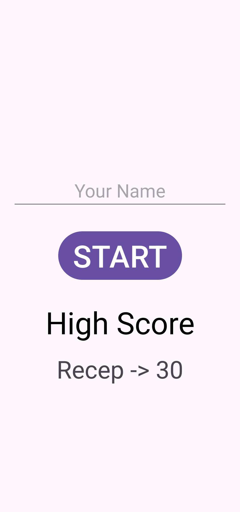
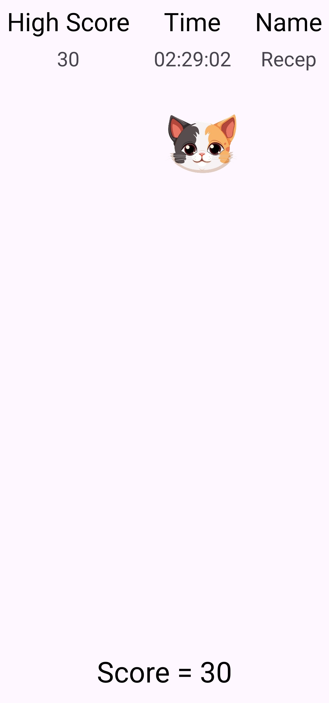
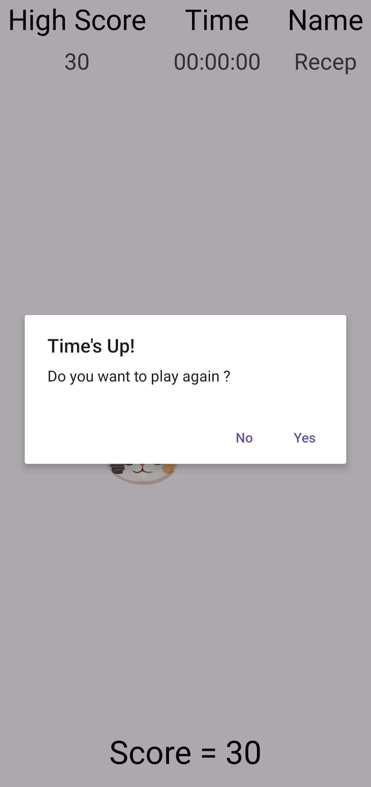

# First Game (Android • Java)

A simple, fast-paced tap game built with Android (Java). Tap the cat that appears randomly on a 4x4 grid to score points before the timer runs out. Your best score is saved locally and shown on the home screen.

## Features
- 4x4 grid with a single visible cat at a time
- 3-minute countdown with millisecond-style display
- Tap-to-score mechanics with instant feedback
- Persistent high score using `SharedPreferences`
- ViewBinding-enabled UI and edge-to-edge layout

## Screenshots

| Game Start                                                                | Gameplay                                                                 | Game Over                                                             |
|---------------------------------------------------------------------------|--------------------------------------------------------------------------|-----------------------------------------------------------------------|
|  |  |  |

## Tech Stack
- Language: Java 8
- Min SDK: 24, Target/Compile SDK: 36
- AndroidX, Material Components, ViewBinding

## Package & Entry Points
- Package: `com.receparslan.firstgame`
- Launcher Activity: `MainActivity`
- Game Activity: `GameActivity`

## How It Works
- `MainActivity` collects the player name and displays the current high score.
- `GameActivity` shows a 4x4 grid of `ImageView`s and reveals one at random every second.
- Tapping a visible cat increases the score and updates the high score in-memory.
- On timer finish, the app prompts to replay or return to the main screen and persists top score/name.

## Requirements
- Android Studio (Giraffe/Koala+ recommended)
- Android SDK Platform 36
- JDK 17 (bundled with latest Android Studio)

## Getting Started

### Open in Android Studio
1. File → Open → select this folder.
2. Let Gradle sync complete.
3. Connect a device or start an emulator.
4. Run the `app` configuration.

### Build from Command Line (Windows PowerShell)
```pwsh
# In the project root
./gradlew.bat clean
./gradlew.bat assembleDebug
```
APK will be at `app/build/outputs/apk/debug/`.

## Project Structure
- App module: `app/`
- Manifest: `app/src/main/AndroidManifest.xml`
- Code: `app/src/main/java/com/receparslan/firstgame/`
- Resources: `app/src/main/res/`
- Screenshots: `screenshots/`

## License
This project is licensed under the MIT License – see [`LICENSE`](LICENSE) for details.

## Acknowledgments
- AndroidX and Material Components
- ViewBinding and Edge-to-Edge APIs